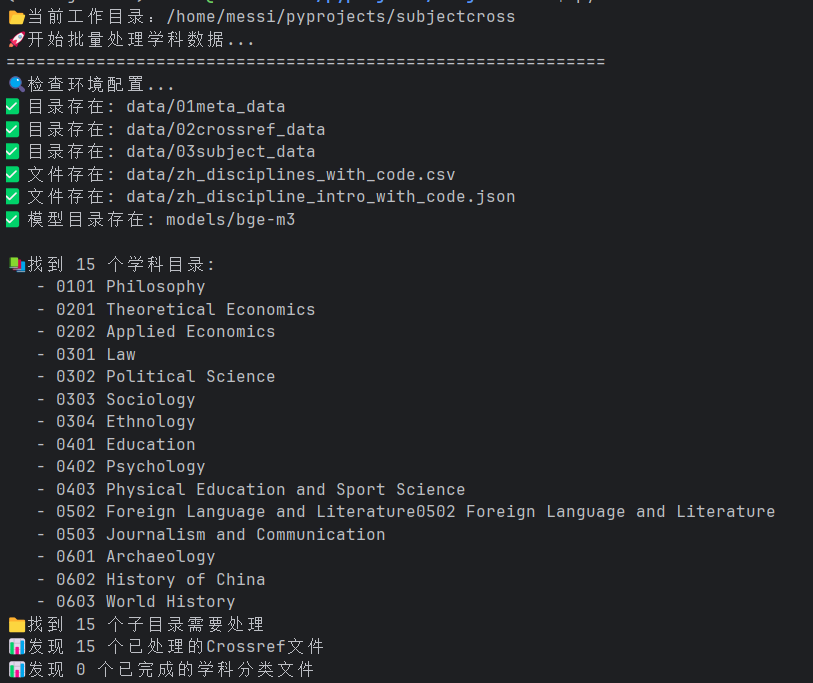
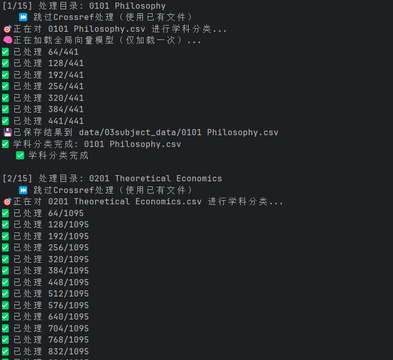
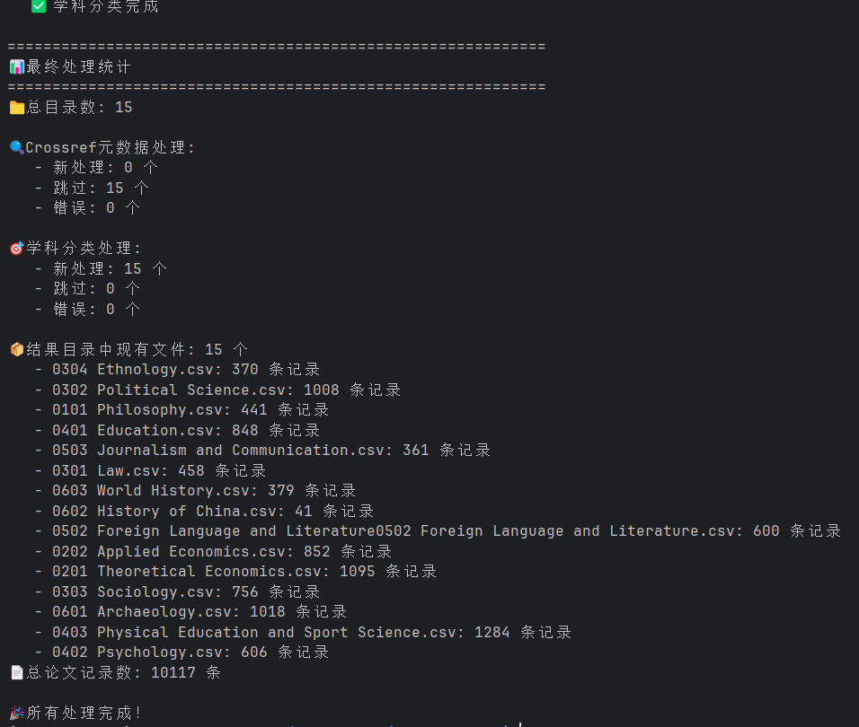

# 数据处理说明文档

## 1.原始数据获取
首先从Incites数据库中下载不同一级学科下的随机100篇论文的元数据，如下图：

把这些数据作为不同一级学科的原始数据存放在data/meta_data路径下

## 2.对原始数据处理，得到用于识别学科类别的数据

### 2.1 通过doi + crossref的Rest接口获取一篇论文
基于原始数据每篇论文的doi获取该论文的更多相关信息

### 2.2 对各种信息合并，得到最终数据结构
保留原始数据中的 doi 来源 研究方向 论文标题 4个字段和crossref接口返回的CR_学科,CR_摘要,CR_作者和机构,CR_参考文献DOI, CR_出版商5个字段

## 3.打分函数定义

### 3.1 基于研究方向的打分函数
采用取均值的方式为不同的研究方向赋予学科分数，默认incites标注的学科权重是一样的，因此研究方向越多，对应的学科分数越低。

### 3.2 基于词向量相似度打分函数
****论文+标题 / 作者机构 / 期刊名称 作为输****入1， 每个学科的描述作为输入2，计算2者的相似度，得到单篇论文与117个学科的相似度并归一化到0-1区间，
相似度作为每个学科的得分。 

***·*** 具体计算过程如下：（一）构建学科描述的分块向量并缓存。把较长的中文学科描述按照指定长度进行分块，然后利用本地
语言模型bge-m3把这些分块编码成向量，并保存到npz缓存，方便以后检索计算。（二）构建查询向量。拼接标题和摘要 / 作者机构 / 期刊，
然后用本地语言模型bge-m3为其编码得到查询向量。（三）向量相似度检索，采用内积检索的方式，计算查询向量与每个学科的
每个分块向量的相似度[-1, 1]区间，然后映射到[0-1]区间。（四）按学科聚合，top-k取平均。将每个学科的每个分块
的相似度得分进行排序，取top-k个的平均值作为与该学科的相似度。

***·*** 待优验证化点：模块可更换更强大的多语种模型；可以考虑将2个输入翻译到同一语种与不翻译的情况做对比

### 3.3 基于参考文献的打分函数
为每个参考文献执行3.1-3.2的打分过程，得到3个来源的得分，每个得分包含了117个学科。然后基于如下权重：

{"作者机构": 0.1, "期刊": 0.3, "标题+摘要": 0.6}

合并每个学科的分数，得到每个学科的综合得分，便得到单个参考文献的学科分布情况及其分数。最后为每个学科基于所有参考文献计算全局平均值并
只保留排名前3的学科，其余学科分数置0

## 4.批量分数计算
基于上述4个打分函数，批量计算多篇论文的多个学科分数并取前3，最后再对前3的学科做筛选，以第一名分数为基准，第2名分数不能低于其80%；
第3名分数不能低于其60%。

具体计算过程如下：1.读取csv文件，按照batch-size大小批量读取论文2.为所有打分函数分别构造批量输入，其中词向量的3个输入可以利用gpu
并行计算。剩余2个则是采用单循环计算一个batch3.最后返回所有的结果并保存至文件

## 5.研究要素映射
基于学科分类得到的学科数据、标题和摘要，做研究要素的映射。即通过调用商业大模型的api（qwen-max），利用提示词
为每篇论文添加一个要素列，里面以json格式出现，包含内容如下：

1. 一个主学科
2. 7个研究要素
3. 每个研究要素组成为，若干个交叉学科（均来自学科分类得到的n个学科）；交叉等级（判断依据是若干个交叉学科在这个要素
中发挥的作用，一共4个等级）；判断理由
4. 总体交叉水平（基于每个研究要素的交叉等级）
5. 总体交叉水平判断理由

具体计算过程，采用异步并发的方式，异步调用Qwen的api完成分析过程，同时采用缓存机制实现断点恢复节约时间

## 6.运行方法
运行 `python -m main` 可以得到学科的补充数据（02crossref_data）和学科的分类数据（03subject_data）

运行 `python -m pipeline.batch_map` 可以得到学科研究要素的映射数据（04map_data）
