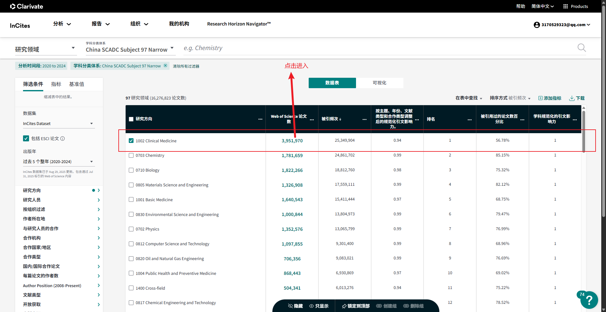
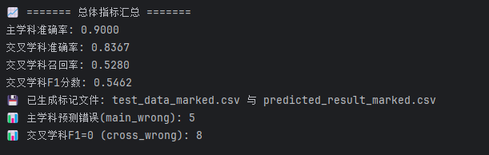

# 数据处理说明文档

## 1. 原始数据获取

从 **Incites 数据库** 中下载各一级学科下随机抽取的约 **3000 篇论文元数据**，作为不同一级学科的初始样本。

  


原始样本数据统一存放于指定目录 `data/01meta_data/`。

---

## 2. 原始数据扩充与结构化

目标：基于 **DOI** 获取论文的完整元数据与学科标签，构建统一结构化表。

### 2.1 Crossref 元数据获取

通过 **DOI + Crossref REST API** 获取论文详细信息，包括：

* 摘要（Abstract）
* 作者与机构信息
* 参考文献列表
* 出版商与期刊信息

输出字段：

| 字段名            | 含义             |
| ----------------- | ---------------- |
| `CR_摘要`         | 摘要             |
| `CR_作者和机构`   | 作者姓名 + 机构   |
| `CR_参考文献DOI`  | 参考文献的 DOI 列表 |
| `CR_出版商`       | 出版单位信息       |

---

### 2.2 OpenAlex 学科主题获取

通过 **DOI + OpenAlex API** 获取论文的学科主题分布，只获取单篇论文的 field 和 subfield 字段学科。  
OpenAlex 提供了一个四层次的学科体系：

| 层级 | 英文名称     | 示例                          |
| ---- | ------------ | ----------------------------- |
| 1    | Domain       | Physical Sciences             |
| 2    | Field        | Computer Science              |
| 3    | Subfield     | Artificial Intelligence       |
| 4    | Topic        | Deep Reinforcement Learning   |

---

### 2.3 OpenAlex–中国一级学科映射表构建

为将 OpenAlex 学科与中国的 **117 个一级学科** 对齐，使用语义相似度映射：

1. **双语相似度匹配**

   * 英文 → 中文（一级学科简介）计算相似度；
   * 翻译成中文后再次计算相似度；
   * 两轮结果取并集。

2. **聚合与筛选**

   * 每个 OpenAlex 的一级学科对应 5 个中国学科（带相似度）；
   * 二级学科对应 2–4 个中国学科。

3. **输出格式示例**

````json
   {
     "Artificial Intelligence": [
       ["0812 计算机科学与技术", 0.91],
       ["1405 智能科学与技术", 0.89],
       ["0835 软件工程", 0.85]
     ]
   }
````

---

### 2.4 数据结构化整合

整合原始数据与 Crossref / OpenAlex 返回结果，形成统一结构：

| 来源       | 字段                                                                                              | 含义     |
| -------- | ----------------------------------------------------------------------------------------------- | ------ |
| Incites  | `DOI`, `论文标题`, `研究方向`                                                                           | 原始学科样本 |
| Crossref | `CR_摘要`, `CR_作者和机构`, `CR_参考文献DOI`                                                               | 元数据    |
| OpenAlex | `OpenAlex_topic_list`, `OpenAlex_field_list`, `OpenAlex_subfield_list`, `OpenAlex_map_subjects` | 学科主题列表 |

数据统一存放于指定目录 `data/02crossref_data/`。

---

## 3. 学科打分与多维识别

目标：根据论文的文本、机构、引用等信息，从五个维度识别其所属一级学科。

---

### 3.1 维度 1 — Incites 研究方向（直接映射）

将 Incites 中的英文研究方向直接映射为中文一级学科列表。
该维度代表人工主观判断，稳定性高，权重较大。

**计算方式**：每个学科取平均值 1/n。

```python
# 示例结果：
[('1204 公共管理学', 0.25),
 ('1205 信息资源管理', 0.25),
 ('1001 基础医学', 0.25),
 ('0812 计算机科学与技术', 0.25)]
```

---

### 3.2 维度 2 — 标题摘要语义相似度（bge-m3 + LLM）

#### 计算流程：

1. 将论文标题 + 摘要拼接为文本；

2. 使用本地模型 **bge-m3** 编码为向量；

3. 与 117 个一级学科简介向量计算相似度；

4. 取前 `k` 个学科（一般为 5）；

5. 输出格式示例：

   ```python
   [('1001 基础医学', 0.7937030593554179),
    ('1002 临床医学', 0.7852583726247152),
    ('1008 中药学', 0.7818259199460348),
    ('0831 生物医学工程', 0.7813626527786255),
    ('1009 特种医学', 0.7809871633847555)]
   ```

6. 大模型进一步判断并给出打分，从中选出 1–3 个学科；

7. 输出格式示例：

   ```python
   [('1204 公共管理学', 0.25),
    ('1205 信息资源管理', 0.25),
    ('1001 基础医学', 0.25),
    ('0812 计算机科学与技术', 0.25)]
   ```

特点：体现论文的语义主题，但偏向表层表述，不作为唯一主学科依据。

---

### 3.3 维度 3 — 作者机构（LLM 直接判断）

对每个作者机构独立识别学科，要求是具体学院而非大学名称：

* 调用大模型直接根据机构名称判断并打分；
* 每个机构返回 1–2 个最相关学科；
* 按照学科分数求和 / 学科出现次数计算每个学科的最终分数，取 top-k 学科（5 个）；
* 输出格式示例：

  ```python
  [[('0714 统计学', 0.9652)],
   [('1004 公共卫生与预防医学', 0.8921),
    ('0710 生物学', 0.8547)],
   [('1004 公共卫生与预防医学', 0.9215),
    ('1002 临床医学', 0.8537)],
   [('1004 公共卫生与预防医学', 0.9215),
    ('1002 临床医学', 0.8537)],
   [('0714 统计学', 0.9652)],
   [('1004 公共卫生与预防医学', 0.9215),
    ('1002 临床医学', 0.8537)],
   [('0812 计算机科学与技术', 0.9215),
    ('0835 软件工程', 0.8547)]]
  ```

---

### 3.4 维度 4 — 参考文献（Ref–OpenAlex）

1. 对论文参考文献调用 OpenAlex API 获取学科；
2. 映射为中国学科和对应的分数；
3. 同样按照作者机构的方式，取得前 top-k（10）个学科；
4. 输出格式示例：

   ```python
   [('1201 管理科学与工程', 0.0353),
    ('0202 应用经济学', 0.0342),
    ('0201 理论经济学', 0.0341),
    ('0824 船舶与海洋工程', 0.0341),
    ('1202 工商管理学', 0.0341),
    ('0810 信息与通信工程', 0.034),
    ('0812 计算机科学与技术', 0.034),
    ('0839 网络空间安全', 0.0339),
    ('0711 系统科学', 0.0337),
    ('0835 软件工程', 0.0336)]
   ```

---

### 3.5 维度 5 — OpenAlex 学科主题映射

一篇论文会有 field 和 subfield，分别映射得到中国学科，按照作者机构和参考文献的方式取得 top-k（5 个）学科。

* 输出格式示例：

```python
[('0839 网络空间安全', 0.0684),
 ('0812 计算机科学与技术', 0.0679),
 ('0835 软件工程', 0.0678),
 ('1205 信息资源管理', 0.0674),
 ('0811 控制科学与工程', 0.0673)]
```

---

## 4. 多维融合与主/交叉学科计算

### 4.1 融合算法总体流程

五个维度的学科结果作为输入：

```text
title_abs + incites + refs + openalex + author
```

构建学科贡献矩阵 →

计算强度 (Intensity)、广度 (Breadth)、平衡性 (Balance) →

合成综合得分 →

筛选主学科与交叉学科。

---

### 4.2 默认权重配置（2025 版）

| 字段名                      | 含义            | 权重       | 说明     |
| ------------------------ | ------------- | -------- | ------ |
| `list_title_abs`         | 标题摘要语义学科      | 0.10     | 表层主题   |
| `list_incites_direction` | Incites 研究方向  | **0.50** | 主学科依据  |
| `list_ref`               | 参考文献          | 0.15     | 研究边界拓展 |
| `list_openalex`          | OpenAlex 学科主题 | 0.20     | 外部验证   |
| `list_author_aff_qwen`   | 作者机构          | 0.05     | 辅助维度   |

---

### 4.3 基于逻辑回归的判断（Logistic Regression）

把五个维度数据 **解析成标准化结构**：

1. 五维度输入如何整理成特征矩阵；
2. 是否需要归一化；
3. 如何构建最终的 X（训练输入）；
4. 如何生成 y（训练标签）；
5. 如何用这些数据做 **Logistic Regression**。

---

#### ✅ 4.3.1 五维度原始数据示例

```python
list_incites_direction
[('0303 社会学', 0.25),
 ('0503 新闻传播学', 0.25),
 ('1004 公共卫生与预防医学', 0.25),
 ('0101 哲学', 0.25)]

list_title_abs
[('1004 公共卫生与预防医学', 0.8359),
 ('1011 护理学', 0.7677),
 ('0303 社会学', 0.7674),
 ('1006 中西医结合', 0.7667),
 ('1002 临床医学', 0.6935)]

list_author_aff_qwen
[('1004 公共卫生与预防医学', 0.175),
 ('1002 临床医学', 0.175)]

list_openalex
[('1001 基础医学', 0.1359),
 ('1002 临床医学', 0.1314),
 ('1004 公共卫生与预防医学', 0.1293),
 ('1011 护理学', 0.1293),
 ('1007 药学', 0.123)]

list_ref
[('0835 软件工程', 0.0312),
 ('0802 机械工程', 0.0312),
 ('0303 社会学', 0.0312),
 ('1002 临床医学', 0.031),
 ('1001 基础医学', 0.031),
 ('0202 应用经济学', 0.031),
 ('0710 生物学', 0.0305),
 ('0201 理论经济学', 0.0304),
 ('0302 政治学', 0.0303),
 ('1004 公共卫生与预防医学', 0.0298)]
```

五个维度原始名称对应如下：

| 维度名称 | 变量名                      |
| ---- | ------------------------ |
| 维度 1 | `list_incites_direction` |
| 维度 2 | `list_title_abs`         |
| 维度 3 | `list_author_aff_qwen`   |
| 维度 4 | `list_openalex`          |
| 维度 5 | `list_ref`               |

---

#### ✅ 4.3.2 五维度特征构造：所有维度 → 一个统一字典结构

先生成一个整体学科集合（所有维度中出现过的学科）：

**全集：**

```text
[
 '0303 社会学',
 '0503 新闻传播学',
 '1004 公共卫生与预防医学',
 '0101 哲学',
 '1011 护理学',
 '1006 中西医结合',
 '1002 临床医学',
 '1001 基础医学',
 '1007 药学',
 '0835 软件工程',
 '0802 机械工程',
 '0202 应用经济学',
 '0710 生物学',
 '0201 理论经济学',
 '0302 政治学'
]
```

共 **15 个学科**。
每个学科都会变成一条训练样本行（X 的一行）。

---

#### ✅ 4.3.3 单篇文章的 5 维向量构造方式

对每个学科 c 构造：

```text
x[c] = [
    score_dim1(c),
    score_dim2(c),
    score_dim3(c),
    score_dim4(c),
    score_dim5(c)
]
```

如果这个维度里没有这个学科 → **填 0**。

例如 **“1004 公共卫生与预防医学”**：

* dim1(`list_incites_direction`) → 0.25
* dim2(`list_title_abs`) → 0.8359
* dim3(`list_author_aff_qwen`) → 0.175
* dim4(`list_openalex`) → 0.1293
* dim5(`list_ref`) → 0.0298

最终五维向量：

```text
[0.25, 0.8359, 0.175, 0.1293, 0.0298]
```

再例如 **“0503 新闻传播学”**：

* dim1 → 0.25
* dim2 → 无 → 0
* dim3 → 0
* dim4 → 0
* dim5 → 0

向量：

```text
[0.25, 0, 0, 0, 0]
```

---

#### ❗ 4.3.4 是否需要归一化？—— 建议归一化

从数据可以看到：

* 维度 1：全部 0.25（范围小）
* 维度 2：0.69–0.83（较大）
* 维度 3：0.175（较小）
* 维度 4：0.123–0.136（中等）
* 维度 5：0.029–0.031（极小）

**五个维度的数值不在同一量纲！**

⇒ Logistic Regression 会错误把 “`list_title_abs`” 维度认为最重要，因为它数值范围最大。

因此建议对每个维度做归一化。
通用做法：对每个维度的所有学科分数做 **Min–Max 归一化 (0–1)**。

---

#### 🔧 4.3.5 实际生成特征的可运行示例代码


输出是一个形状为 `(15, 5)` 的矩阵：**15 个学科 × 5 个维度**。

---

#### ✅ 4.3.6 标签构建与模型选择
一、 一开始选择的是相似性二分类判断问题，所以采用了一个线性回归模型，标签则是0（非主学科或者交叉学科），1（主学科或者交叉学科）。而这个根本无法判断出一个学科是否是主学科还是交叉学科，所以抛弃了

二、然后改成了三分类问题，采用了随机森林，SVM2种方法，标签则是0，1，2；表示不相关，交叉学科和主学科。在这个方法里，最终采用的数据依旧是学科层面的，从50个标注论文中抽取出所有的学科和他们对应的特征表示(对于每一篇论文，分别从list_incites_direction,list_title_abs,list_author_aff_qwen,list_openalex,list_ref这5个维度中提取出出现的学科代码，然后构建每个学科的特征向量，出现的维度就用对应分数，没出现就用0，然后对应标签就是，如果是主学科就是2，如果出现在交叉学科字段就是1，否则就是0。)。然后基于训练数据计算全局min-max，然后做归一化。训练之后进行预测，预测的输入依旧是一个学科的5维度特征向量，然后预测0，1，2的概率。
但是由于数据量太小，训练数据如果不包含预测数据中出现的学科或者包含的太少，那么做预测效果就会很差，同时数据量太小，每次训练的模型随机性较强，对于不同学科的预测效果会变化

---

#### 4.3.7 问题记录
1. 
    训练时，学科名称在不同步骤可能存在翻译/命名差异，需要统一使用 **前 4 位学科代码**（如 `"1004"`），避免文本表述带来匹配失败。

2. 
    第一次采用的方式是线性回归二分类，样本的构建结果是：(每个学科的5维特征, 该学科是主学科/交叉学科 or 不是主学科/交叉学科)，是一个相关性二分类问题。模型学习到的是这个学科与这篇论文是否相关，输出的概率是这个学科与这个论文的相关性。
    然而真正要做的任务却是3分类问题，即判断一个学科是主学科，还是交叉学科还是什么都不是。具体的做法是计算一个概率，然后通过概率的高低来判断主学科，剩下的是交叉学科，这就与训练时候的任务定义不同了。
    除此之外，由于标注的时候没有区分主学科和交叉学科，导致交叉学科的信号被稀释了。
    最后在预测的时候根据每个学科的概率高低来划分主学科和交叉学科的方式也有问题，因为每个概率大小表示的是这个学科与这个论文的（主学科/交叉学科）相关性，也无法区分主学科和交叉学科。
    总的来说，不能用二分类模型去完成三类+排序任务。
3. 
    第二次采用三分类的建模方式，采用了SVM和随机森林的方式。但是也存在问题，例如一篇论文会有多个学科，然后用训练好的模型去预测每个学科的类别，但是这样就会导致论文可能有多个主学科并且无法区分。

---

### 4.4 综合得分计算公式

在另一种评分策略中，对每个学科定义综合得分：

```text
Score = Intensity × (1 + 0.3 × Breadth) × (1 + 0.2 × Balance)
```

其中：

* **Intensity**：总贡献值（五维加权后的总分）；
* **Breadth**：出现维度数 ÷ 5（最大为 1）；
* **Balance**：几何均衡度（多维均衡程度，可根据各维标准差/熵等构造）。

---

### 4.5 主学科与交叉学科判定规则

| 筛选条件 | 说明                                                                                                     |
| ---- | ------------------------------------------------------------------------------------------------------ |
| 主学科  | 综合得分最高者                                                                                                |
| 交叉学科 | 满足以下全部：<br>① 分数 ≥ 0.6 × 主学科分数<br>② 至少出现在 2 个维度<br>③ 出现在 title_abs 或 incites 中<br>④ 累积覆盖率 ≥ 80% 或数量 ≥ 3 |

---

### 4.6 新策略：Weighted 多维加权法（默认启用）

`weighted` 策略面向“多视角异质信号”的稳健融合：
**先在每个视角内部归一化，再用外部权重线性加权**，最后结合**统计分布驱动的动态交叉学科选择**。

#### 4.6.1 核心流程

1. **视角解析与展开**

   从五个视角读取候选学科-分数对（允许嵌套），展开为二元组列表：

   * `title_abs`（题名+摘要向量/语义匹配）
   * `incites`（方向/人工标注/权威词表）
   * `refs`（参考文献学科映射）
   * `openalex`（OpenAlex 主题→学科映射）
   * `author`（作者机构/单位归属学科）

2. **视角内部归一化（Softmax / Min–Max）**

   对每个视角内部的候选分数做归一化，得到该视角下的“概率型”分布，既能**抑制极端值**，又能**凸显高相关项**。一般形式：

   ```text
   p_i = exp(x_i - max_j x_j) / Σ_j exp(x_j - max_j x_j)
   ```

3. **外部权重融合（线性加权）**

   按视角权重把各视角的归一化分数加权求和，得到学科总分：

   ```text
   Total(d) = Σ_v w_v · p_v(d)
   ```

   其中 `v ∈ {title_abs, incites, refs, openalex, author}`。
   权重来源于环境变量，若未设置则默认：

   * `WEIGHT_TITLE_ABS = 0.1`
   * `WEIGHT_INCITES   = 0.5`
   * `WEIGHT_REFS      = 0.15`
   * `WEIGHT_OPENALEX  = 0.15`
   * `WEIGHT_AUTHOR    = 0.1`

4. **主学科确定**

   按 `Total` 降序排序，最高者为 **主学科**。

---

## 5. 动态交叉学科选择（精简版：自然断点 + 差距约束）

1. **统计量准备**

   对按分数降序的序列 `scores = [s₀ ≥ s₁ ≥ …]` 计算：

   * 均值、标准差、四分位数（可选）；
   * 相邻差序列 `gaps[i] = sᵢ - sᵢ₊₁`；
   * `gaps` 的均值与标准差。

2. **自然断点（宽松）**

   用阈值 `thr = mean_gap + 0.5 × std_gap` 寻找**第一处显著断层**：

   * 找到第一个满足 `gaps[i] ≥ thr` 的位置 `i`；
   * 断点后一项索引 `break_after = i + 1`；
   * 为避免误伤第二名：断点至少从第 3 名生效，即 `keep_right = max(2, break_after)`；
   * 候选初集为排名区间 **[第 2 名 … keep_right−1]**。

3. **相邻差距约束（前后降幅）**

   在上述候选区间内，从**第 3 名**起依次检查**相对降幅**：

   * 若 `(sᵢ₋₁ − sᵢ) / sᵢ₋₁ > max_gap_ratio`（默认 0.6），
   * 则将候选区间**立即截断**到 `i−1`，其后各项全部丢弃。

4. **产出与上限**

   * 交叉学科即为最终区间内的学科标签列表（**从第 2 名开始**，按分数降序）；
   * 并施加 `topk_cross` 上限（默认 3）。

5. **参数说明（可调）**

   * `break_k`（此处固定为 0.5）控制断层敏感度：更小更“宽松”，更容易提前出现断点；更大更“保守”；
   * `max_gap_ratio` 控制前后降幅的“止损”强度：更小更严格，稍降就截断；更大更宽容。

---

### 归一化与融合配置

| 视角/维度     | 归一化方法       | 说明与取舍                      |
| --------- | ----------- | -------------------------- |
| title_abs | **Softmax** | 语义相关性分布化，凸显高相似度候选，抑制长尾噪声   |
| incites   | **Min–Max** | 采用 Min–Max，可显著提升交叉学科的召回率   |
| refs      | **Softmax** | 引文来源多且尺度不一，用 Softmax 平衡尺度差 |
| openalex  | **Softmax** | 主题映射后的权重差距经 Softmax 平滑，更鲁棒 |
| author    | **Softmax** | 机构分布稀疏且离散，Softmax 聚焦主相关机构  |

> 说明：默认实现中大部分视角采用 Softmax；`incites` 采用 Min–Max 能在召回率上有明显收益。实际代码中可以通过 `norm_map` 对不同视角切换 Softmax / Min–Max。

---

### detail 输出结构

* `primary`: 主学科；
* `cross`: 动态筛选出的交叉学科列表（并列友好，上限 `topk_cross`）；
* `detail`：

  * `detail[d].total`：学科 d 的融合总分；
  * `detail[d].views`：五视角的**归一化分**（缺失视角自动补 `0.0`），便于溯源与可解释。

示例（节选）：

```json
{
  "primary": "0812 计算机科学与技术",
  "cross": ["1001 基础医学", "1205 信息资源管理", "1204 公共管理学"],
  "detail": {
    "0831 生物医学工程": {
      "total": 0.03528892134750596,
      "views": {
        "title_abs": 0.35288921347505964,
        "incites": 0.0,
        "refs": 0.0,
        "openalex": 0.0,
        "author": 0.0
      }
    }
    ...
  }
}
```

（实际输出包含全部学科，此处仅示意。）

---

### 4.6 算法优势小结

* ✅ 多维融合（五视角）
* ✅ 自适应归一化（Softmax + Min–Max）
* ✅ 权重可配置（支持 `.env` 配置文件）
* ✅ `detail` 结构可视化友好（适合雷达图展示）
* ✅ 策略可扩展（`default` / `weighted` / 自定义）

---

## 6. 研究要素识别（后处理阶段）

在得到学科分类结果后，可进一步调用 LLM（如 Qwen-Max）识别论文的研究要素。

每篇论文生成 JSON 结构示例：

```json
{
  "主学科": "0812 计算机科学与技术",
  "研究问题": { "交叉学科": ["0303 社会学"], "等级": "Level 2" },
  "研究方法": { "交叉学科": ["0839 网络空间安全"], "等级": "Level 1" },
  "总体交叉水平": "高",
  "判断理由": "研究问题融合社会学与智能科学理论。"
}
```

---

## 7. 批处理运行方法

```bash
# 仅获取 Crossref 元数据
python main.py --mode getmeta

# 仅执行参考文献 OpenAlex 映射
python main.py --mode getref

# 仅生成统一输入文件
python main.py --mode getinput

# 仅执行学科打分（不再调用 LLM）
python main.py --mode getrank
```

还支持单文件/单目录运行：

```bash
python main.py --mode getrank --file data/04input_data/0812_计算机科学与技术.csv
```

---

## 8. 参数说明

| 参数           | 默认值  | 含义         |
| ------------ | ---- | ---------- |
| `alpha`      | 0.3  | 广度调节系数     |
| `beta`       | 0.2  | 平衡性调节系数    |
| `rel_thr`    | 0.6  | 交叉学科相对强度阈值 |
| `cover_thr`  | 0.8  | 累积得分覆盖率阈值  |
| `topk_cross` | 3    | 最大交叉学科数    |
| `.env` 文件    | 环境变量 | 定义权重、模型路径等 |

---

## 9. 权重配置建议（经验值）

主学科识别优先考虑 **Incites** 与 **OpenAlex**（外部权威判断），
交叉学科识别依赖 **参考文献** 与 **标题摘要**。

| 来源            | 权重       | 作用        |
| ------------- | -------- | --------- |
| **Incites**   | **0.50** | 主学科判定核心依据 |
| **OpenAlex**  | **0.20** | 外部主题参考    |
| **Refs**      | **0.15** | 研究边界学科拓展  |
| **Title/Abs** | **0.10** | 语义内容补充    |
| **Author**    | **0.05** | 辅助支撑      |

---

## 10. 结果输出

| 列名        | 含义              |
| --------- | --------------- |
| `primary` | 主学科             |
| `cross`   | 交叉学科（逗号分隔）      |
| `result`  | JSON 格式完整结果     |
| `detail`  | 各学科在五个视角下的权重与得分 |

---

### 数据集准确率测试的逻辑

1. **预测与标注比较（主学科）：**
   在每篇论文中，对比预测的主学科与标注的主学科，并计算得分。

   * 如果预测主学科被包含在标注的主学科集合中，得分为 1；
   * 否则得分为 0。

2. **交叉学科评分：**

   需要计算 **准确率（Precision）** 和 **召回率（Recall）** 两种指标：

   * 只要预测的交叉学科出现在标注的主学科或者交叉学科中，就算正确
     （因为预测的主学科只有 1 个，其余都是交叉学科；标注的主学科可能有多个，有些预测交叉学科会被标注成主学科，所以出现于标注主学科也视作命中）；

   * 准确率计算：

     ```text
     P = 命中的预测学科数量 / 预测交叉学科总数
     ```

   * 召回率计算：

     ```text
     R = 命中的预测学科数量 / 标注主学科 + 标注交叉学科总数
     ```

   * 若标注的交叉学科为空，则另外处理：

     * 如果预测的交叉学科完全匹配标注（主学科集合），得分为 1；
     * 部分匹配得分为 0.8（可按业务约定设定）。

3. **加权计算：**

   最终对每个样本计算主学科得分和交叉学科得分，并按权重加权：

   * 主学科权重：0.6
   * 交叉学科权重：0.4

4. **准确率计算：**

   对全部样本的得分求和 / 样本数，得到整体准确率。

---

## 11. 当前方法存在问题和一些实验发现

### 11.1 OpenAlex 领域 → 中国 117 一级学科映射表

该映射表当前仅依靠 bge-m3 词向量模型进行计算，存在 **相似度坍缩** 问题，导致不同学科的向量相似度过大、难以区分。
目前正在考虑使用大模型接口进行映射：仍保持

* 大领域（field）映射到 5 个候选学科；
* 小领域（subfield）映射到 2 个候选学科。

实验证明效果确实有所提升，尤其是在交叉学科判断上。
使用 DeepSeek 深度思考得到的映射表结果如下：


---

### 11.2 只在单一维度得分的情况

有些论文只在单一维度上有得分（通常是词向量方法判断不准确导致），且多个学科得分相同，导致主学科判断错误。

---

### 11.3 词向量判断不准确

当前标题摘要的学科判断是基于 bge-m3 获取的相似度，然后：

1. 获取前 5 学科作为备选；
2. 再让大模型从中选取 1–3 个学科。

问题在于：bge-m3 给出的备选学科本身不太准确。
理想做法是和作者机构一致：

* 给定标题摘要和 117 个学科名称；
* 由大模型直接判断 1–3 个主学科。

为保持方法一致性，可以：

* 用 bge-m3 获取备选集合；
* 用大模型在备选上重新判 1–3 个学科；
* 分别保存这两列结果，但最后输入融合时采用“大模型判断列”。

经过测试发现：**单独用大模型判断的准确率不如两者结合**，无论主学科还是交叉学科，准确率都有明显下降。
因此当前策略仍保留“词向量 + 大模型二阶段”的结构。

---

### 11.4 不同维度归一化方式对结果的影响

各维度内部采用 Softmax 还是 Min–Max（或混合使用），对最终主学科和交叉学科的准确率及召回率有明显影响。

示例如下：

* **全部用 Softmax** + DeepSeek 映射表：

  

* **仅 Incites 维度采用 Min–Max，其余维度采用 Softmax** + DeepSeek 映射表：

  

可见适当对 Incites 采用 Min–Max，有利于提高交叉学科的召回率。

---

### 11.5 不同维度权重设置的影响

在更改映射表后，原来较为偏重人工标注维度（Incites）的设置也需要调整。
由于其他维度准确率有所提升，需要：

* **降低** Incites 权重；
* **提高** 其他维度权重。

实验证明，这样的调整对主学科准确率提升有较大帮助：


---

## 12. 大模型微调

### 12.1 模型选择与介绍

模型地址：
[https://modelscope.cn/models/Qwen/Qwen2.5-0.5B-Instruct](https://modelscope.cn/models/Qwen/Qwen2.5-0.5B-Instruct)

模型简介：此仓库包含经过指令调优的 **0.5B 参数 Qwen2.5 模型**，具有以下特点：

* 类型：因果语言模型（Causal LM）
* 训练阶段：预训练 + 后训练
* 架构：带有 RoPE、SwiGLU、RMSNorm、注意力 QKV 偏置和绑定词嵌入的 Transformer
* 参数数量：0.49B
* 非嵌入参数数量：0.36B
* 层数：24
* 注意力头数（GQA）：Q 为 14，KV 为 2
* 上下文长度：完整 32,768 tokens，生成 8192 tokens

---

### 12.2 数据预处理

原始的数据结构并不符合微调的数据格式要求，需要先对最后得到的学科分类数据进行预处理，得到微调所需的数据集。

目标数据结构：

```json
{"instruction": "引导词", "input": "标题 + 摘要", "output": "{primary: (1004 公共卫生与预防医学, 0.241392); cross: [(0303 社会学, 0.16001)]}"}
```

处理步骤：

* 从原始数据中的各字段提取出论文标题和摘要，以及对应的主学科和交叉学科及其分数；
* 将不同学科的 CSV 文件统一转化成使用相同模板的 JSONL 文件，便于模型习得任务格式；
* 在转化数据的同时，对微调数据进行统计，得到如下指标：

```json
{
  "total_files_found": 94,
  "total_jsonl_existing": 94,
  "total_valid_samples": 36515,
  "global_max_input_chars": 5962,
  "global_max_output_chars": 126,
  "global_max_input_tokens": 1534,
  "global_max_output_tokens": 97
}
```

一共有效论文数为 **36515 条**，分布在 **94 个学科** 之中：

* 单条论文最大输入 token 长度约为 1534；
* 单条论文最大输出 token 长度约为 97。

---

## 13. 大模型学科识别任务：微调与评测说明

### 13.1 数据构建
在构建成数据的时候，由于采用的训练模板是qwen3系列的，所以构建的数据集是
```json
  {"conversation_id": "10.3390/pr11082248$No36", 
  "category": "主/交叉学科判定（117 一级学科，多标签）", 
  "conversation": [
    {
      "human": 
        "你是一名论文学科的分类专家，擅长通过给定的论文标题和摘要，判断出论文的主学科和涉及的交叉学科。现在给你一篇论文的标题和摘要，请判断： 1）论文的主学科（primary） 2）论文涉及的交叉学科（cross），最多 3 个，可为空\n【论文信息】\n论文标题: DPPH Radical Scavenging Assay\n论文摘要: Today, there is an increasing interest in antioxidants, especially to prevent the known harmful effects of free radicals in human metabolism and their deterioration during processing and storage of fatty foods. In both cases, natural-source antioxidants are preferred over synthetic antioxidants. So, there has been a parallel increase in the use of assays to estimate antioxidant efficacy in human metabolism and food systems. Today, there are many bioanalytical methods that measure the antioxidant effect. Of these, the 1,1-diphenyl-2-picrylhydrazil (DPPH) removing assay is the most putative, popular, and commonly used method to determine antioxidant ability. In this review, a general approach to the DPPH radical scavenging assay has been taken. In this context, many studies, including attempts to adapt the DPPH radical scavenging method to different analytes, search for the highest antioxidant activity values, and optimize the method of measurement, have previously been performed. Therefore, it is highly important to introduce measures aimed at standardizing the conditions of the DPPH radical scavenging activity, including the various reaction media suitable for this assay. For this aim, the chemical and basic principles of DPPH free radical scavenging are defined and discussed in an outline. In addition, this study describes and defines the basic sections of DPPH free radical scavenging in food and biological systems. Additionally, some chemical, critical, and technical details of the DPPH free radical removal method are given. This is a simple assay in which the prospective compounds or herbal extracts are mixed with the DPPH solution and their absorbance is measured after a certain period. However, despite rapid advances in instrumental techniques and analysis, this method has not undergone extreme modification. This study presents detailed information about the DPPH method and an in-depth review of different developments.\n【输出格式要求】\n• 输出格式为 JSON，不能包含额外解释。\n• primary 必须且只能有 1 个，格式：'代码 学科名'\n• cross 是数组，每个元素为 代码 学科名（最多 3 个）\n【输出示例】\n{'primary': '0812 计算机科学与技术','cross': ['0831 生物医学工程', '0702 物理学']}", 
      "assistant": {
        "primary": "0817 化学工程与技术", 
        "cross": []
        }
      }]
}
```
并且得是字符串格式的，所以在构建json的时候会出现转义字符斜杠