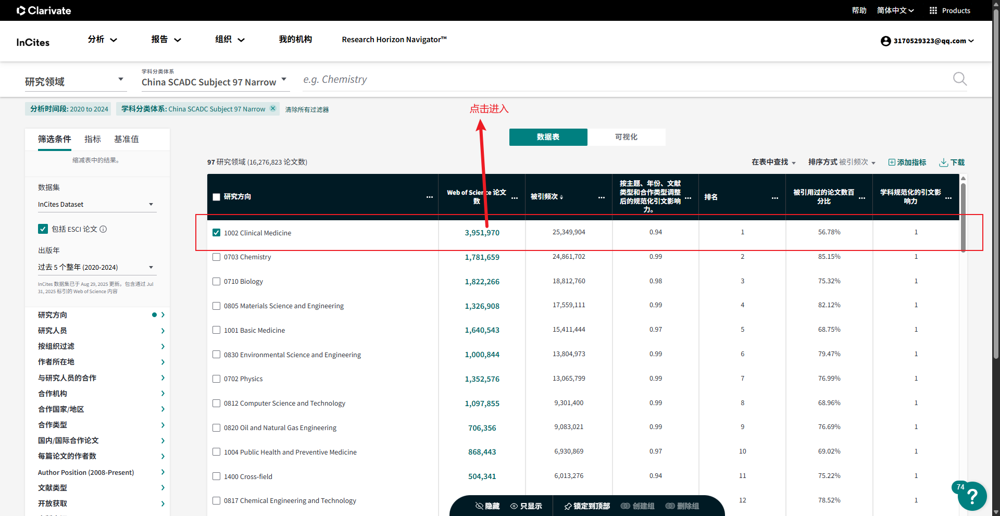
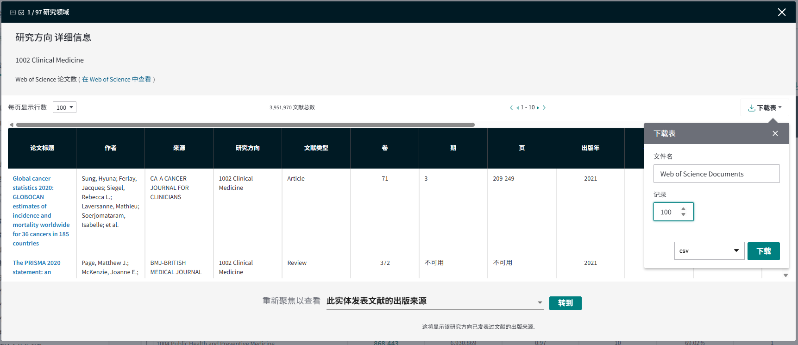

# 数据处理说明文档

## 1.原始数据获取
首先从Incites数据库中下载不同一级学科下的随机100篇论文的元数据，如下图：

把这些数据作为不同一级学科的原始数据存放在data/meta_data路径下

## 2.对原始数据处理，得到用于识别学科类别的数据

### 2.1 通过doi + crossref的Rest接口获取一篇论文
基于原始数据每篇论文的doi获取该论文的更多相关信息

### 2.2 对各种信息合并，得到最终数据结构
保留原始数据中的 doi 来源 研究方向 论文标题 4个字段和crossref接口返回的CR_学科,CR_摘要,CR_作者和机构,CR_参考文献DOI, CR_出版商5个字段
