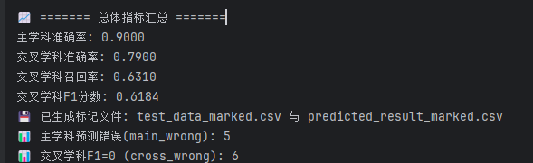
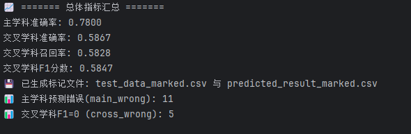

# 数据处理说明文档（2025 修订版）

## 1. 原始数据获取

从 **Incites 数据库** 中下载各一级学科下随机抽取的约 **3000 篇论文元数据**，作为不同一级学科的初始样本。


原始样本数据统一存放于指定目录 `data/01meta_data/`。

---

## 2. 原始数据扩充与结构化

目标：基于 **DOI** 获取论文的完整元数据与学科标签，构建统一结构化表。

### 2.1 Crossref 元数据获取

通过 **DOI + Crossref REST API** 获取论文详细信息，包括：

* 摘要（Abstract）
* 作者与机构信息
* 参考文献列表
* 出版商与期刊信息

输出字段：

| 字段名          | 含义         |
| ------------ | ---------- |
| `CR_摘要`      | 摘要         |
| `CR_作者和机构`   | 作者姓名 + 机构  |
| `CR_参考文献DOI` | 参考文献的DOI列表 |
| `CR_出版商`     | 出版单位信息     |

---

### 2.2 OpenAlex 学科主题获取

通过 **DOI + OpenAlex API** 获取论文的学科主题分布，只获取单篇论文的field和subfield字段学科。
OpenAlex 提供了一个四层次的学科体系：

| 层级 | 英文名称     | 示例                          |
| -- | -------- | --------------------------- |
| 1  | Domain   | Physical Sciences           |
| 2  | Field    | Computer Science            |
| 3  | Subfield | Artificial Intelligence     |
| 4  | Topic    | Deep Reinforcement Learning |

---

### 2.3 OpenAlex–中国一级学科映射表构建

为将 OpenAlex 学科与中国的 **117 个一级学科** 对齐，使用语义相似度映射：

1. **双语相似度匹配**

   * 英文 → 中文（一级学科简介）计算相似度
   * 翻译成中文后再次计算相似度
   * 两轮结果取并集

2. **聚合与筛选**

   * 每个 OpenAlex 的一级学科对应 5 个中国学科（带相似度）
   * 二级学科对应 2–4 个中国学科

3. **输出格式**

   ```json
   {
     "Artificial Intelligence": [
       ["0812 计算机科学与技术", 0.91],
       ["1405 智能科学与技术", 0.89],
       ["0835 软件工程", 0.85]
     ]
   }


---

### 2.4 数据结构化整合

整合原始数据与 Crossref / OpenAlex 返回结果，形成统一结构：

| 来源       | 字段                                                                                            | 含义     |
| -------- | --------------------------------------------------------------------------------------------- | ------ |
| Incites  | `DOI`, `论文标题`, `研究方向`                                                                         | 原始学科样本 |
| Crossref | `CR_摘要`, `CR_作者和机构`, `CR_参考文献DOI`                                                             | 元数据    |
| OpenAlex | `OpenAlex_topic_list`, `OpenAlex_field_list`,`OpenAlex_subfield_list`,`OpenAlex_map_subjects` | 学科主题列表 |

数据统一存放于指定目录 `data/02crossref_data/`。

---

## 3. 学科打分与多维识别

目标：根据论文的文本、机构、引用等信息，从五个维度识别其所属一级学科。

---

### 3.1 维度 1 — Incites 研究方向（直接映射）

将 Incites 中的英文研究方向直接映射为中文一级学科列表。
该维度代表人工主观判断，稳定性高，权重较大。

**计算方式**：每个学科取平均值1/n

```python
# 示例结果：
[('1204 公共管理学', 0.25), ('1205 信息资源管理', 0.25), ('1001 基础医学', 0.25), ('0812 计算机科学与技术', 0.25)]
```

---

### 3.2 维度 2 — 标题摘要语义相似度（bge-m3 + llm）

#### 计算流程：

1. 将论文标题 + 摘要拼接为文本；
2. 使用本地模型 **bge-m3** 编码为向量；
3. 与 117 个一级学科简介向量计算相似度；
4. 取前 `k` 个学科（一般为 5）；
5. 输出格式：

   ```python
   [('1001 基础医学', 0.7937030593554179), ('1002 临床医学', 0.7852583726247152), ('1008 中药学', 0.7818259199460348), ('0831 生物医学工程', 0.7813626527786255), ('1009 特种医学', 0.7809871633847555)]
   ```
6. 大模型进一步判断并给出打分，取出1-3个学科
7. 输出格式：

   ```python
   [('1204 公共管理学', 0.25), ('1205 信息资源管理', 0.25), ('1001 基础医学', 0.25), ('0812 计算机科学与技术', 0.25)]
   ```

特点：体现论文的语义主题，但偏向表层表述，不作为唯一主学科依据。

---

### 3.3 维度 3 — 作者机构（llm直接判断）

对每个作者机构独立识别学科，要求是具体学院而非大学名称：

* 调用大模型直接根据机构名称判断并打分
* 每个机构返回 1–2 个最相关学科
* 按照学科分数求和 / 学科出现次数计算每个学科的最终分数，取top-k个学科（5）
* 输出格式：

  ```python
  [[('0714 统计学', 0.9652)], [('1004 公共卫生与预防医学', 0.8921), 
  ('0710 生物学', 0.8547)], [('1004 公共卫生与预防医学', 0.9215), 
  ('1002 临床医学', 0.8537)], [('1004 公共卫生与预防医学', 0.9215), 
  ('1002 临床医学', 0.8537)], [('0714 统计学', 0.9652)], 
  [('1004 公共卫生与预防医学', 0.9215), ('1002 临床医学', 0.8537)], 
  [('0812 计算机科学与技术', 0.9215), ('0835 软件工程', 0.8547)]]
  ```

---

### 3.4 维度 4 — 参考文献（Ref–OpenAlex）

1. 对论文参考文献调用 OpenAlex API 获取学科；
2. 映射为中国学科和对应的分数；
3. 同样按照作者机构的方式，取得前topk（10）个学科
4. 输出格式：

   ```python
   [('1201 管理科学与工程', 0.0353), ('0202 应用经济学', 0.0342), ('0201 理论经济学', 0.0341),
    ('0824 船舶与海洋工程', 0.0341), ('1202 工商管理学', 0.0341), ('0810 信息与通信工程', 0.034)
   , ('0812 计算机科学与技术', 0.034), ('0839 网络空间安全', 0.0339), ('0711 系统科学', 0.0337), ('0835 软件工程', 0.0336)]
   ```

---

### 3.5 维度 5 — OpenAlex 学科主题映射

一篇论文会有field和subfield，分别映射得到中国学科，按照作者机构和参考文献的方式取得topk（5）个学科

* 输出格式：

```python
[('0839 网络空间安全', 0.0684), ('0812 计算机科学与技术', 0.0679), ('0835 软件工程', 0.0678), ('1205 信息资源管理', 0.0674), ('0811 控制科学与工程', 0.0673)]
```

---

## 4. 多维融合与主/交叉学科计算

### 4.1 融合算法总体流程

五个维度的学科结果作为输入：

```
title_abs + incites + refs + openalex + author
```

构建学科贡献矩阵 →
计算强度 (Intensity)、广度 (Breadth)、平衡性 (Balance) →
合成综合得分 →
筛选主学科与交叉学科。

---

### 4.2 默认权重配置（2025 版）

| 字段名                      | 含义            | 权重       | 说明     |
| ------------------------ | ------------- | -------- | ------ |
| `list_title_abs`         | 标题摘要语义学科      | 0.10     | 表层主题   |
| `list_incites_direction` | Incites 研究方向  | **0.50** | 主学科依据  |
| `list_ref`               | 参考文献          | 0.15     | 研究边界拓展 |
| `list_openalex`          | OpenAlex 学科主题 | 0.20     | 外部验证   |
| `list_author_aff_qwen`   | 作者机构          | 0.05     | 辅助维度   |

---

### 4.3 综合得分计算公式

对于每个学科：

[
Score = Intensity × (1 + 0.3×Breadth) × (1 + 0.2×Balance)
]

* **Intensity**：总贡献值
* **Breadth**：出现维度数 ÷ 5
* **Balance**：几何均衡度（多维均衡性）

---

### 4.4 主学科与交叉学科判定规则

| 筛选条件 | 说明                                                                                                     |
| ---- | ------------------------------------------------------------------------------------------------------ |
| 主学科  | 综合得分最高者                                                                                                |
| 交叉学科 | 满足以下全部：<br>① 分数 ≥ 0.6 × 主学科分数<br>② 至少出现在 2 个维度<br>③ 出现在 title_abs 或 incites 中<br>④ 累积覆盖率 ≥ 80% 或数量 ≥ 3 |

---

### 4.5 新策略：Weighted 多维加权法（默认启用）

`weighted` 策略面向“多视角异质信号”的稳健融合：**先在每个视角内部归一化，再用外部权重线性加权**，最后结合**统计分布驱动的动态交叉学科选择**。

#### 核心流程

1. **视角解析与展开**
   从五个视角读取候选学科-分数对（允许嵌套），展开为二元组列表：

* `title_abs`（题名+摘要向量/语义匹配）
* `incites`（方向/人工标注/权威词表）
* `refs`（参考文献学科映射）
* `openalex`（OpenAlex 主题→学科映射）
* `author`（作者机构/单位归属学科）

2. **视角内部归一化（Softmax）**
   对每个视角内部的同类候选分数做 **Softmax**，得到该视角下的“概率型”分布，既能**抑制极端值**，又能**凸显高相关项**：
   [
   p_i=\frac{\exp(x_i-\max_j x_j)}{\sum_j \exp(x_j-\max_j x_j)}
   ]

3. **外部权重融合（线性加权）**
   按视角权重把各视角的归一化分数加权求和，得到学科总分：
   [
   \text{Total}(d)=\sum_{v\in{\text{title_abs, incites, refs, openalex, author}}} w_v \cdot p_v(d)
   ]
   权重来源于环境变量，若未设置则默认：

* `WEIGHT_TITLE_ABS=0.1`
* `WEIGHT_INCITES=0.5`
* `WEIGHT_REFS=0.15`
* `WEIGHT_OPENALEX=0.15`
* `WEIGHT_AUTHOR=0.1`

4. **主学科确定**
   按 `Total` 降序排序，最高者为 **主学科**。

5. **动态交叉学科选择**

* 计算分数序列统计量：均值、标准差、四分位数、变异系数、相邻差距序列及其最大差距；
* 基于相邻差距寻找**自然断点**；为避免误伤第 2 名，断点至少从第 3 名开始生效；
* 双阈值约束：

  * **相对阈值**：候选分数 ≥ `min_relative_threshold × 主学科分数`（默认 0.3）
  * **绝对阈值**：候选分数 ≥ `min_absolute_threshold`（默认 0.05）
* **差距约束**：若与上一名差距超过 `max_gap_ratio`（默认 0.5）则舍弃；
* **分布自适应**：

  * 变异系数大（>0.8）：仅纳入高于 `均值+1σ` 的候选；
  * 中等（>0.3）：纳入高于 `Q1` 的候选；
  * 集中（≤0.3）：保守纳入前若干名（≤3）；
* **并列友好**：引入 `tie_eps` 自适应容差（与主分数成比例），对**与当前入选项同分**（或极接近）的后续项**一并纳入**；
* **保底策略**：若仍为空且第二名达到主学科的 60%，纳入第二名，并**把与第二名并列者**一并纳入；
* 最终数量受 `topk_cross` 上限约束（默认 3）。

#### 归一化与融合配置

| 视角/维度     | 归一化方法       | 说明与取舍                              |
| --------- |-------------|------------------------------------|
| title_abs | **Softmax** | 语义相关性分布化，凸显高相似度候选，抑制长尾噪声           |
| incites   | **MInmax**  | 采用minmax，可以显著提升交叉学科的召回率            |
| refs      | **Softmax** | 引文来源多且尺度不一，用 softmax 平衡不同论文/来源的尺度差 |
| openalex  | **Softmax** | 主题映射后的权重差距经 softmax 平滑，鲁棒性更高       |
| author    | **Softmax** | 机构分布稀疏且离散，softmax 可稳健聚焦主相关机构       |

> 说明：本策略统一采用 Softmax 做“视角内”归一化，实践中表现更稳健；若需切换为 Min–Max，可在实现中修改 `norm_map`。

#### 输出结构（detail）

* `primary`: 主学科
* `cross`: 动态筛选出的交叉学科列表（并列友好，上限 `topk_cross`）
* `detail`:

  * `detail[d].total`：学科 d 的融合总分
  * `detail[d].views`：五视角的**归一化分**（缺失视角自动补 `0.0`），便于溯源与可解释

#### 关键参数（可调优）

* `min_relative_threshold`（默认 0.30）：交叉候选需达到主学科的最小相对比例
* `min_absolute_threshold`（默认 0.05）：交叉候选的最低绝对分
* `max_gap_ratio`（默认 0.50）：与前一名允许的最大相对降幅
* `topk_cross`（默认 3）：交叉学科上限
* `use_statistical_cross`（默认 True）：是否启用统计分布驱动的动态选择
* `alpha, beta`：仅影响 `default` 策略（广度/平衡性系数），对 `weighted` 无影响
* `WEIGHT_*`：五视角外部权重，支持 `.env` 配置

#### 为什么更稳健？

* **尺度对齐**：先视角内 softmax，把“不同量纲/不同稀疏度”的分数带到同一概率空间；
* **可解释融合**：外部权重明确反映业务偏好（如 `incites=0.8`）；
* **统计自适应**：用分布特征（CV、断点、分位）控制“选几门、怎么选”，避免固定阈值的“一刀切”；
* **并列不遗漏**：同分/极接近项不会被断点误杀，保证次高分并列的公平性。

#### detail 输出结构：

```json
{"primary": "0812 计算机科学与技术", "cross": ["1001 基础医学", "1205 信息资源管理", "1204 公共管理学"], "detail": {"0831 生物医学工程": {"total": 0.03528892134750596, "views": {"title_abs": 0.35288921347505964, "incites": 0.0, "refs": 0.0, "openalex": 0.0, "author": 0.0}}, "1002 临床医学": {"total": 0.06407237746292345, "views": {"title_abs": 0.3362161191097655, "author": 0.6090153110389379, "incites": 0.0, "refs": 0.0, "openalex": 0.0}}, "1001 基础医学": {"total": 0.5310894667415175, "views": {"title_abs": 0.31089466741517485, "incites": 1.0, "refs": 0.0, "openalex": 0.0, "author": 0.0}}, "1204 公共管理学": {"total": 0.5, "views": {"incites": 1.0, "title_abs": 0.0, "refs": 0.0, "openalex": 0.0, "author": 0.0}}, "1205 信息资源管理": {"total": 0.5181818181818186, "views": {"incites": 1.0, "openalex": 0.0909090909090932, "title_abs": 0.0, "refs": 0.0, "author": 0.0}}, "0812 计算机科学与技术": {"total": 0.6252814559786395, "views": {"incites": 1.0, "refs": 0.09998999089839357, "openalex": 0.5454545454545466, "author": 0.023840965059423954, "title_abs": 0.0}}, "1201 管理科学与工程": {"total": 0.015018009362209303, "views": {"refs": 0.10012006241472869, "title_abs": 0.0, "incites": 0.0, "openalex": 0.0, "author": 0.0}}, "0202 应用经济学": {"total": 0.015001498634475958, "views": {"refs": 0.10000999089650639, "title_abs": 0.0, "incites": 0.0, "openalex": 0.0, "author": 0.0}}, "0201 理论经济学": {"total": 0.014999998559617504, "views": {"refs": 0.09999999039745003, "title_abs": 0.0, "incites": 0.0, "openalex": 0.0, "author": 0.0}}, "0824 船舶与海洋工程": {"total": 0.014999998559617504, "views": {"refs": 0.09999999039745003, "title_abs": 0.0, "incites": 0.0, "openalex": 0.0, "author": 0.0}}, "1202 工商管理学": {"total": 0.014999998559617504, "views": {"refs": 0.09999999039745003, "title_abs": 0.0, "incites": 0.0, "openalex": 0.0, "author": 0.0}}, "0810 信息与通信工程": {"total": 0.014998498634759034, "views": {"refs": 0.09998999089839357, "title_abs": 0.0, "incites": 0.0, "openalex": 0.0, "author": 0.0}}, "0839 网络空间安全": {"total": 0.21499699885988557, "views": {"refs": 0.09997999239923702, "openalex": 1.0, "title_abs": 0.0, "incites": 0.0, "author": 0.0}}, "0711 系统科学": {"total": 0.014993999760033556, "views": {"refs": 0.09995999840022371, "title_abs": 0.0, "incites": 0.0, "openalex": 0.0, "author": 0.0}}, "0835 软件工程": {"total": 0.10590159134411574, "views": {"refs": 0.09995000290016703, "openalex": 0.4545454545454534, "author": 0.0, "title_abs": 0.0, "incites": 0.0}}, "0811 控制科学与工程": {"total": 0.0, "views": {"openalex": 0.0, "title_abs": 0.0, "incites": 0.0, "refs": 0.0, "author": 0.0}}, "0714 统计学": {"total": 0.019195902780256256, "views": {"author": 0.3839180556051251, "title_abs": 0.0, "incites": 0.0, "refs": 0.0, "openalex": 0.0}}, "1004 公共卫生与预防医学": {"total": 0.05, "views": {"author": 1.0, "title_abs": 0.0, "incites": 0.0, "refs": 0.0, "openalex": 0.0}}, "0710 生物学": {"total": 0.0, "views": {"author": 0.0, "title_abs": 0.0, "incites": 0.0, "refs": 0.0, "openalex": 0.0}}}}
```


---

### 4.6 算法优势

✅ 多维融合（五视角）  
✅ 自适应归一化（Softmax + Min–Max）  
✅ 权重可配置（支持 `.env` 配置文件）  
✅ detail 结构可视化友好（适合雷达图展示）  
✅ 策略可扩展（`default` / `weighted` / 自定义）

---

## 5. 研究要素识别（后处理阶段）

在得到学科分类结果后，可进一步调用 LLM（如 Qwen-Max）识别论文的研究要素。

每篇论文生成 JSON 结构：

```json
{
  "主学科": "0812 计算机科学与技术",
  "研究问题": {"交叉学科": ["0303 社会学"], "等级": "Level 2"},
  "研究方法": {"交叉学科": ["0839 网络空间安全"], "等级": "Level 1"},
  "总体交叉水平": "高",
  "判断理由": "研究问题融合社会学与智能科学理论。"
}
````

---

## 6. 批处理运行方法

```bash
# 仅获取 Crossref 元数据
python main.py --mode getmeta

# 仅执行参考文献 OpenAlex 映射
python main.py --mode getref

# 仅生成统一输入文件
python main.py --mode getinput

# 仅执行学科打分（不再调用LLM）
python main.py --mode getrank
```

还支持单文件/单目录运行：

```bash
python main.py --mode getrank --file data/04input_data/0812_计算机科学与技术.csv
```

---

## 7. 参数说明

| 参数           | 默认值  | 含义         |
| ------------ | ---- | ---------- |
| `alpha`      | 0.3  | 广度调节系数     |
| `beta`       | 0.2  | 平衡性调节系数    |
| `rel_thr`    | 0.6  | 交叉学科相对强度阈值 |
| `cover_thr`  | 0.8  | 累积得分覆盖率阈值  |
| `topk_cross` | 3    | 最大交叉学科数    |
| `.env` 文件    | 环境变量 | 定义权重、模型路径等 |

---

## 8. 权重配置建议（经验值）

主学科识别优先考虑 **Incites** 与 **OpenAlex**（外部权威判断），
交叉学科识别依赖 **参考文献** 与 **标题摘要**。

| 来源            | 权重       | 作用        |
| ------------- | -------- | --------- |
| **Incites**   | **0.50** | 主学科判定核心依据 |
| **OpenAlex**  | **0.20** | 外部主题参考    |
| **Refs**      | **0.15** | 研究边界学科拓展  |
| **Title/Abs** | **0.10** | 语义内容补充    |
| **Author**    | **0.05** | 辅助支撑      |

---

## 9. 结果输出

| 列名        | 含义              |
| --------- | --------------- |
| `primary` | 主学科             |
| `cross`   | 交叉学科（逗号分隔）      |
| `result`  | JSON 格式完整结果     |
| `detail`  | 各学科在五个视角下的权重与得分 |

---

### 数据集准确率测试的逻辑

1. **预测与标注比较：**
   在每篇论文中，对比预测的主学科与标注的主学科，并计算得分。如果预测主学科被包含在标注的主学科里面，得分为 1；否则得分为0。

2. **交叉学科评分：**
   需要计算准确率和召回率2种；其中只要预测的交叉学科出现在标注的主学科或者交叉学科，就算正确（因为预测的主学科只有1个，其余都是交叉学科。而标注的主学科会有多个，这就导致有些预测的交叉学科被标注到主学科了，所以如果预测的交叉学科出现在标注的主学科，那么也是可以的）
   * 准确率的计算为：在标注的主学科和交叉学科种出现的预测学科数量/总的预测交叉学科数量
   * 召回率的计算为：在标注的主学科和交叉学科种出现的预测学科数量/总的标注主学科和标注交叉学科
   如果标注的交叉学科为空，则另外处理。如果预测的交叉学科完全匹配标注，得分为 1；部分匹配得分为 0.8。

3. **加权计算：**
   最终计算总分时，主学科和交叉学科得分按权重进行加权，主学科的权重为 0.6，交叉学科的权重为 0.4。

4. **准确率计算：**
   计算每个样本的得分，然后通过累积得分计算准确率。


## 10. 当前方法存在问题和一些实验发现

### 10.1 openalex 领域 -> 中国117一级学科映射表

该映射表的构建当前仅依靠bge-m3词向量模型进行计算，存在 **相似度坍缩** 问题，导致不同学科的向量相似度过大难以区分。
目前正在考虑用大模型接口进行映射，还是大领域映射到5个，小领域映射到2个

发现效果确实有所提升，尤其是在交叉学科判断上面。
使用deepseek深度思考得到的映射表结果：


### 10.2 只在单一维度得分的情况

有些论文只在单一维度上有得分（词向量方法判断不准确导致），且得分相同，导致主学科判断错误。

### 10.3 词向量判断不准确

当前标题摘要的学科判断是基于bge-m3获取的，然后获取前5学科备选，再让大模型去从中选取1-3个学科。但是bge-m3给出的
备选学科本身就不太准确，不如和作者机构采用同样的方法，给定标题摘要和117个学科名称，由大模型判断1-3个主学科。为了保持方法的一致性
可以单独用bge-m3获取备选，再单独用大模型判断，然后保存这2列，但是最后输入还是采用大模型判断的结果。

经过测试，发现单独用大模型判断的准确率不如2者结合，无论是主学科还是交叉学科，其判断准确率都下降较明显

### 10.4 调整不同维度的归一化方式，对结果亦有影响

每个维度内部采用 softmax 还是 min-max 方式，还是混合使用，对于最终主学科和交叉学科的准确率以及召回率会有不同的影响
 
下面是全部用 softmax 和采用deepseek映射表 的结果：


下面是对incites维度采用minmax，其他维度采用softmax 和采用deepseek映射表 的结果：


### 10.5 不同维度权重的设置

在更改了映射表后，原来比较偏重人工标注维度（incites）的情况也需要对应更改，因为其他维度准确率有所提高，所以要降低incites的权重，提高其他维度权重。
这对于主学科的准确率提示有较大帮助。

下面是调小 incites 维度权重，提升其他维度权重的结果：



