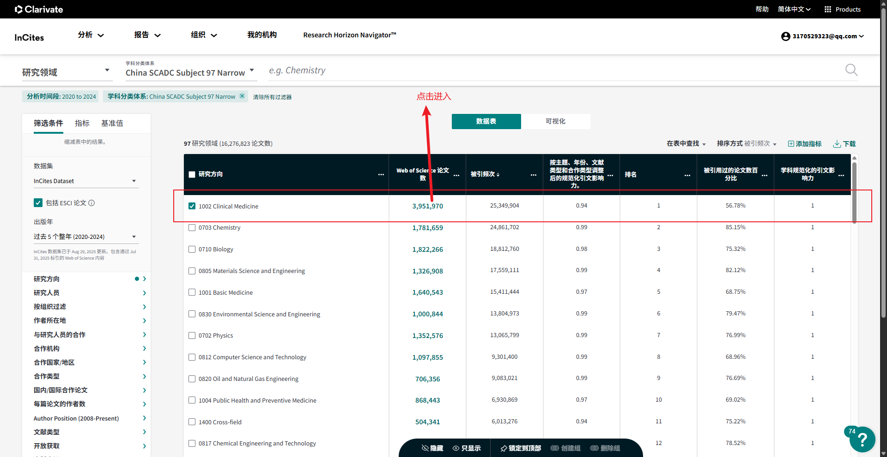
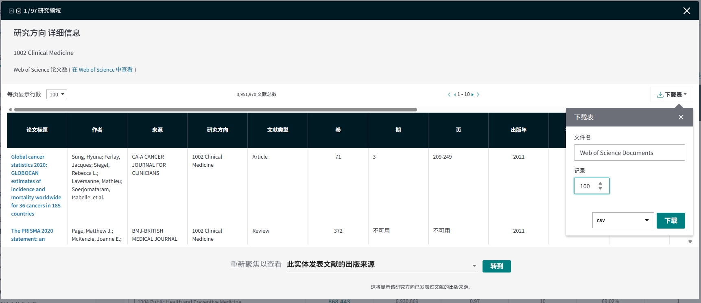
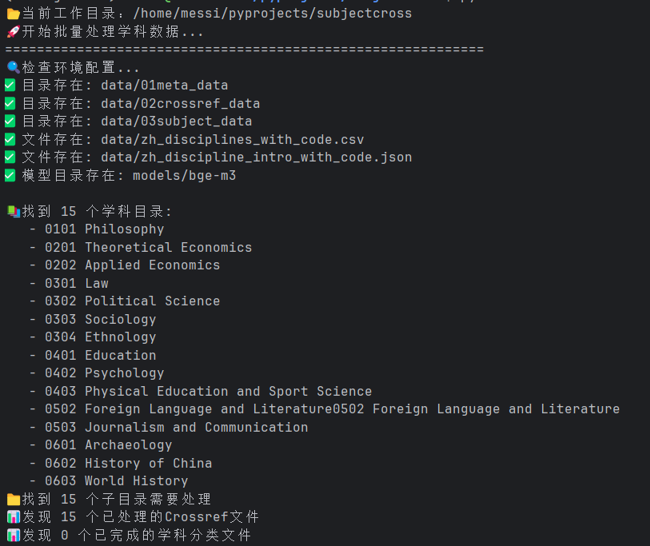
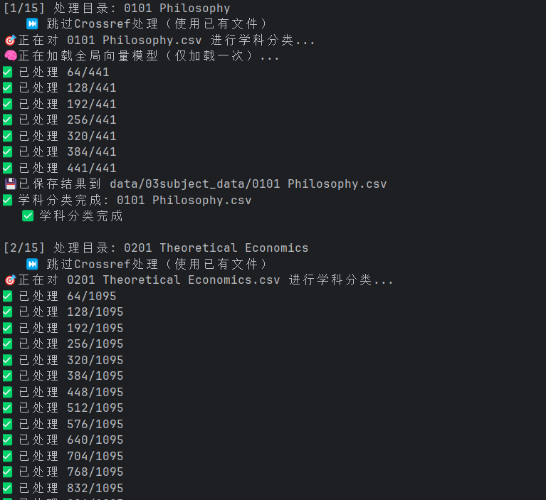
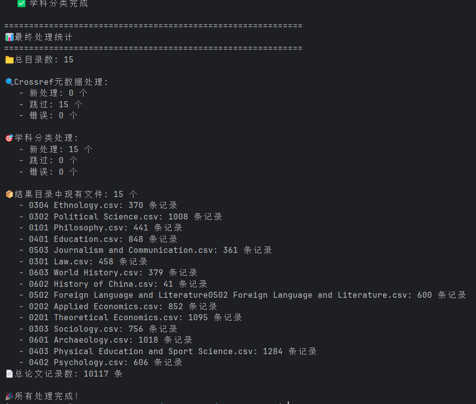

# 数据处理说明文档

## 1.原始数据获取
首先从Incites数据库中下载不同一级学科下的随机100篇论文的元数据，如下图：

把这些数据作为不同一级学科的原始数据存放在data/meta_data路径下

## 2.对原始数据处理，得到用于识别学科类别的数据

### 2.1 通过doi + crossref的Rest接口获取一篇论文
基于原始数据每篇论文的doi获取该论文的更多相关信息

### 2.2 对各种信息合并，得到最终数据结构
保留原始数据中的 doi 来源 研究方向 论文标题 4个字段和crossref接口返回的CR_学科,CR_摘要,CR_作者和机构,CR_参考文献DOI, CR_出版商5个字段

## 3.打分函数定义

### 3.1 基于研究方向的打分函数
采用取均值的方式为不同的研究方向赋予学科分数，默认incites标注的学科权重是一样的，因此研究方向越多，对应的学科分数越低。

### 3.2 基于词向量相似度打分函数
****论文+标题 / 作者机构 / 期刊名称 作为输****入1， 每个学科的描述作为输入2，计算2者的相似度，得到单篇论文与117个学科的相似度并归一化到0-1区间，
相似度作为每个学科的得分。 

***·*** 具体计算过程如下：（一）构建学科描述的分块向量并缓存。把较长的中文学科描述按照指定长度进行分块，然后利用本地
语言模型bge-m3把这些分块编码成向量，并保存到npz缓存，方便以后检索计算。（二）构建查询向量。拼接标题和摘要 / 作者机构 / 期刊，
然后用本地语言模型bge-m3为其编码得到查询向量。（三）向量相似度检索，采用内积检索的方式，计算查询向量与每个学科的
每个分块向量的相似度[-1, 1]区间，然后映射到[0-1]区间。（四）按学科聚合，top-k取平均。将每个学科的每个分块
的相似度得分进行排序，取top-k个的平均值作为与该学科的相似度。

***·*** 待优验证化点：模块可更换更强大的多语种模型；可以考虑将2个输入翻译到同一语种与不翻译的情况做对比

### 3.3 基于参考文献的打分函数
为每个参考文献执行3.1-3.2的打分过程，得到3个来源的得分，每个得分包含了117个学科。然后基于如下权重：

{"作者机构": 0.1, "期刊": 0.3, "标题+摘要": 0.6}

合并每个学科的分数，得到每个学科的综合得分，便得到单个参考文献的学科分布情况及其分数。最后为每个学科基于所有参考文献计算全局平均值并
只保留排名前3的学科，其余学科分数置0

## 4.批量分数计算
基于上述4个打分函数，批量计算多篇论文的多个学科分数并取前3，最后再对前3的学科做筛选，以第一名分数为基准，第2名分数不能低于其80%；
第3名分数不能低于其60%。

具体计算过程如下：1.读取csv文件，按照batch-size大小批量读取论文2.为所有打分函数分别构造批量输入，其中词向量的3个输入可以利用gpu
并行计算。剩余2个则是采用单循环计算一个batch3.最后返回所有的结果并保存至文件

### 分数示例
1.基于作者机构的打分

{'0101 哲学': 0.7334476113319397, '0201 理论经济学': 0.7275566856066386, '0202 应用经济学': 0.7258720000584921, '0301 法学': 0.7427210807800293, '0302 政治学': 0.733437915643
0563, '0303 社会学': 0.7288908759752909, '0304 民族学': 0.7376540303230286, '0305 马克思主义理论': 0.7306167284647623, '0306 公安学': 0.7311209042867025, '0307 中共党史党建学
: 0.7289396524429321, '0308 纪检监察学': 0.724303126335144, '0401 教育学': 0.7420201500256857, '0402 心理学': 0.732539435227712, '0403 体育学': 0.7311886350313822, '0501 中  
国语言文学': 0.7324468493461609, '0502 外国语言文学': 0.7402764558792114, '0503 新闻传播学': 0.7329358061154684, '0601 考古学': 0.751542309919993, '0602 中国史': 0.7485399246
21582, '0603 世界史': 0.7360536853472391, '0701 数学': 0.737906813621521, '0702 物理学': 0.7463512023289999, '0703 化学': 0.7303185065587362, '0704 天文学': 0.746077120304107
7, '0705 地理学': 0.7562897602717081, '0706 大气科学': 0.7385891874631246, '0707 海洋科学': 0.7273869514465332, '0708 地球物理学': 0.7289422949155172, '0709 地质学': 0.736685
7926050822, '0710 生物学': 0.7381727496782938, '0711 系统科学': 0.7410077850023905, '0712 科学技术史': 0.7318394382794698, '0713 生态学': 0.7454694708188375, '0714 统计学': 0
.7477259437243143, '0801 力学': 0.7391670346260071, '0802 机械工程': 0.7376980781555176, '0803 光学工程': 0.7372479438781738, '0804 仪器科学与技术': 0.7499416669209799, '0805
 材料科学与工程': 0.7399695515632629, '0806 冶金工程': 0.7428503433863322, '0807 动力工程及工程热物理': 0.7427017092704773, '0808 电气工程': 0.7426116466522217, '0809 电子科 
学与技术': 0.7461065848668417, '0810 信息与通信工程': 0.7443785866101583, '0811 控制科学与工程': 0.7502313454945883, '0812 计算机科学与技术': 0.7459705670674642, '0813 建筑学
: 0.7348398168881735, '0814 土木工程': 0.740524431069692, '0815 水利工程': 0.7315918803215027, '0816 测绘科学与技术': 0.7444472511609396, '0817 化学工程与技术': 0.74596959355
249329, '0818 地质资源与地质工程': 0.7392183144887289, '0819 矿业工程': 0.7531618674596151, '0820 石油与天然气工程': 0.7375803192456564, '0821 纺织科学与工程': 0.732814649740
8549, '0822 轻工技术与工程': 0.7424161235491434, '0823 交通运输工程': 0.7354146242141724, '0824 船舶与海洋工程': 0.7450660268465678, '0825 航空宇航科学与技术': 0.739133040110
2701, '0826 兵器科学与技术': 0.743704080581665, '0827 核科学与技术': 0.7390053470929464, '0828 农业工程': 0.7405975262324015, '0829 林业工程': 0.7267992297808329, '0830 环境 
科学与工程': 0.7389889359474182, '0831 生物医学工程': 0.7399260600407919, '0832 食品科学与工程': 0.7573469082514445, '0833 城乡规划学': 0.7576550443967184, '0835 软件工程': 0
.7385764320691427, '0836 生物工程': 0.733107348283132, '0837 安全科学与工程': 0.7322662274042765, '0838 公安技术': 0.7369385759035746, '0839 网络空间安全': 0.7362729708353678
, '0901 作物学': 0.7288896242777506, '0902 园艺学': 0.7444919347763062, '0903 农业资源与环境': 0.7360767920811971, '0904 植物保护': 0.7438825766245524, '0905 畜牧学': 0.75355
43839136759, '0906 兽医学': 0.7480167945226034, '0907 林学': 0.7442768812179565, '0908 水产': 0.7540754874547323, '0909 草学': 0.7268911997477213, '0910 水土保持与荒漠化防治 
学': 0.7444587747255961, '1001 基础医学': 0.7410361766815186, '1002 临床医学': 0.7393439412117004, '1003 口腔医学': 0.7427135507265726, '1004 公共卫生与预防医学': 0.743546903
1333923, '1005 中医学': 0.7403811812400818, '1006 中西医结合': 0.7312729756037394, '1007 药学': 0.7436989545822144, '1008 中药学': 0.7427276571591696, '1009 特种医学': 0.7416
378855705261, '1011 护理学': 0.7396772702534994, '1012 法医学': 0.733946164449056, '1101 军事思想与军事历史': 0.0, '1102 战略学': 0.7198078632354736, '1103 联合作战学': 0.0, 
'1104 军兵种作战学': 0.0, '1105 军队指挥学': 0.7278160254160563, '1106 军队政治工作学': 0.7283202012379965, '1107 军事后勤学': 0.7435573935508728, '1108 军事装备学': 0.723120
4112370809, '1109 军事管理学': 0.7240890661875407, '1110 军事训练学': 0.7294903794924418, '1111 军事智能': 0.0, '1201 管理科学与工程': 0.7472049196561178, '1202 工商管理学': 
0.7373976508776346, '1203 农林经济管理': 0.730941633383433, '1204 公共管理学': 0.7302552858988444, '1205 信息资源管理': 0.7362105449040731, '1301 艺术学': 0.726482888062795, 
'1401 集成电路科学与工程': 0.7501439253489176, '1402 国家安全学': 0.7293627262115479, '1403 设计学': 0.7310389479001363, '1404 遥感科学与技术': 0.7438189586003622, '1405 智能
学与技术': 0.7422771056493124, '1406 纳米科学与工程': 0.741522490978241, '1407 区域国别学': 0.7450233300526937}

2. 基于期刊名称的打分示例

{'0101 哲学': 0.6988513668378195, '0201 理论经济学': 0.68453 3
3417224884, '0202 应用经济学': 0.6858709255854288, '0301 法学': 0.6917757590611776, '0302 政治学': 0.6904367407162985, '0303 社会学': 0.6904558738072714, '0304 民族学': 0.677
4495244026184, '0305 马克思主义理论': 0.6829040050506592, '0306 公安学': 0.689392109711965, '0307 中共党史党建学': 0.674895703792572, '0308 纪检监察学': 0.6872504552205404, '
0401 教育学': 0.6975894769032797, '0402 心理学': 0.6864823301633199, '0403 体育学': 0.6832391818364462, '0501 中国语言文学': 0.6971876422564188, '0502 外国语言文学': 0.689437
468846639, '0503 新闻传播学': 0.6999459465344747, '0601 考古学': 0.6970891952514648, '0602 中国史': 0.6829848289489746, '0603 世界史': 0.6836138367652893, '0701 数学': 0.6983
010371526083, '0702 物理学': 0.7177989284197489, '0703 化学': 0.7127921382586161, '0704 天文学': 0.7168238560358683, '0705 地理学': 0.710508406162262, '0706 大气科学': 0.7254
248857498169, '0707 海洋科学': 0.7286463578542074, '0708 地球物理学': 0.7270518938700358, '0709 地质学': 0.7081674734751383, '0710 生物学': 0.6889057556788126, '0711 系统科学
: 0.6927548249562582, '0712 科学技术史': 0.7009557485580444, '0713 生态学': 0.6897758642832438, '0714 统计学': 0.6875913540522257, '0801 力学': 0.7359065016110738, '0802 机  
械工程': 0.7176800966262817, '0803 光学工程': 0.7076226075490316, '0804 仪器科学与技术': 0.7073659300804138, '0805 材料科学与工程': 0.7291665474573771, '0806 冶金工程': 0.712
80570824941, '0807 动力工程及工程热物理': 0.7290970087051392, '0808 电气工程': 0.7125707864761353, '0809 电子科学与技术': 0.7182751893997192, '0810 信息与通信工程': 0.6970367
630322775, '0811 控制科学与工程': 0.7202707529067993, '0812 计算机科学与技术': 0.7026564081509908, '0813 建筑学': 0.7038944959640503, '0814 土木工程': 0.7226280172665914, '08
15 水利工程': 0.7093046307563782, '0816 测绘科学与技术': 0.7156693339347839, '0817 化学工程与技术': 0.7101187308629354, '0818 地质资源与地质工程': 0.7167630990346273, '0819  
矿业工程': 0.7108827431996664, '0820 石油与天然气工程': 0.7266164819399515, '0821 纺织科学与工程': 0.7210708657900492, '0822 轻工技术与工程': 0.7172273794809977, '0823 交通运
工程': 0.6978197892506918, '0824 船舶与海洋工程': 0.7307323018709818, '0825 航空宇航科学与技术': 0.735113799571991, '0826 兵器科学与技术': 0.720091700553894, '0827 核科学与与
术': 0.7178520560264587, '0828 农业工程': 0.7111536065737406, '0829 林业工程': 0.7169069250424703, '0830 环境科学与工程': 0.7022692362467448, '0831 生物医学工程': 0.6946691 1
075960795, '0832 食品科学与工程': 0.6999390125274658, '0833 城乡规划学': 0.6831820805867513, '0835 软件工程': 0.690938671429952, '0836 生物工程': 0.6954229474067688, '0837 安
科学与工程': 0.7107844352722168, '0838 公安技术': 0.7047528227170309, '0839 网络空间安全': 0.7042257984479269, '0901 作物学': 0.7009557286898295, '0902 园艺学': 0.698787907 7
7593485, '0903 农业资源与环境': 0.6924292047818502, '0904 植物保护': 0.6960503260294596, '0905 畜牧学': 0.6938444574673971, '0906 兽医学': 0.6716951330502828, '0907 林学': 0.
7175849676132202, '0908 水产': 0.7070664962132772, '0909 草学': 0.6880515019098917, '0910 水土保持与荒漠化防治学': 0.7011867960294088, '1001 基础医学': 0.6867086887359619, '1
002 临床医学': 0.6840507785479227, '1003 口腔医学': 0.6740186015764872, '1004 公共卫生与预防医学': 0.6763588984807333, '1005 中医学': 0.6836060881614685, '1006 中西医结合': 0
.6813416481018066, '1007 药学': 0.683292806148529, '1008 中药学': 0.6854115525881449, '1009 特种医学': 0.7016413410504659, '1011 护理学': 0.6917951107025146, '1012 法医学': 0
.6826949914296468, '1101 军事思想与军事历史': 0.0, '1102 战略学': 0.6930985649426779, '1103 联合作战学': 0.0, '1104 军兵种作战学': 0.0, '1105 军队指挥学': 0.6885537505149841,
 '1106 军队政治工作学': 0.6869683663050333, '1107 军事后勤学': 0.7049927115440369, '1108 军事装备学': 0.7011050979296366, '1109 军事管理学': 0.6940219402313232, '1110 军事训 
练学': 0.7022519111633301, '1111 军事智能': 0.0, '1201 管理科学与工程': 0.7051618099212646, '1202 工商管理学': 0.6995479265848795, '1203 农林经济管理': 0.6789507269859314, '1
204 公共管理学': 0.6781297922134399, '1205 信息资源管理': 0.6861334443092346, '1301 艺术学': 0.6897091666857401, '1401 集成电路科学与工程': 0.7128986517588297, '1402 国家安全
': 0.698085347811381, '1403 设计学': 0.704225758711497, '1404 遥感科学与技术': 0.7212831377983093, '1405 智能科学与技术': 0.6975933710734049, '1406 纳米科学与工程': 0.70778 8
91031901041, '1407 区域国别学': 0.6896750728289286}

3. 基于标题+摘要的打分

{'0101 哲学': 0.6918470859527588, '0201 理论经济学': 0.7080451647440592, '0202 应用经济学': 0.7166040539741516, '0301 法学
: 0.6989575028419495, '0302 政治学': 0.6962471604347229, '0303 社会学': 0.6924301783243815, '0304 民族学': 0.6816726326942444, '0305 马克思主义理论': 0.6992398103078207, '033
06 公安学': 0.6976532936096191, '0307 中共党史党建学': 0.6923308173815409, '0308 纪检监察学': 0.6860476732254028, '0401 教育学': 0.7212043404579163, '0402 心理学': 0.68205451
96533203, '0403 体育学': 0.6833972930908203, '0501 中国语言文学': 0.6945422490437826, '0502 外国语言文学': 0.696995755036672, '0503 新闻传播学': 0.7046218315760294, '0601 考 
古学': 0.6953503688176473, '0602 中国史': 0.691739022731781, '0603 世界史': 0.6816567977269491, '0701 数学': 0.7083016832669576, '0702 物理学': 0.7137025793393453, '0703 化学
: 0.7087186177571615, '0704 天文学': 0.7001502712567648, '0705 地理学': 0.7322431604067484, '0706 大气科学': 0.7314425508181254, '0707 海洋科学': 0.7353472510973612, '0708   
地球物理学': 0.7057162125905355, '0709 地质学': 0.7174775203069051, '0710 生物学': 0.7057623068491617, '0711 系统科学': 0.7198276917139689, '0712 科学技术史': 0.7087578177452
087, '0713 生态学': 0.7118214964866638, '0714 统计学': 0.7023829817771912, '0801 力学': 0.7548994421958923, '0802 机械工程': 0.7283100883165995, '0803 光学工程': 0.7215540011
723837, '0804 仪器科学与技术': 0.7318604389826456, '0805 材料科学与工程': 0.7406342426935831, '0806 冶金工程': 0.7346005837122599, '0807 动力工程及工程热物理': 0.743718167146
047, '0808 电气工程': 0.7337442437807719, '0809 电子科学与技术': 0.72715296347936, '0810 信息与通信工程': 0.7295481562614441, '0811 控制科学与工程': 0.7408954501152039, '0812
 计算机科学与技术': 0.7389190395673116, '0813 建筑学': 0.7207080721855164, '0814 土木工程': 0.7376205126444498, '0815 水利工程': 0.7386485735575358, '0816 测绘科学与技术': 0.
7334551413853964, '0817 化学工程与技术': 0.7163671255111694, '0818 地质资源与地质工程': 0.7272418737411499, '0819 矿业工程': 0.730547825495402, '0820 石油与天然气工程': 0.747
9883432388306, '0821 纺织科学与工程': 0.7368119955062866, '0822 轻工技术与工程': 0.7413632472356161, '0823 交通运输工程': 0.7328345974286398, '0824 船舶与海洋工程': 0.7652813
394864401, '0825 航空宇航科学与技术': 0.7520293394724528, '0826 兵器科学与技术': 0.7239162723223368, '0827 核科学与技术': 0.740935226281484, '0828 农业工程': 0.72391339143117
27, '0829 林业工程': 0.7210077444712321, '0830 环境科学与工程': 0.7223042050997416, '0831 生物医学工程': 0.7075524727503458, '0832 食品科学与工程': 0.6978366176287333, '0833 
城乡规划学': 0.7218956549962362, '0835 软件工程': 0.7348613341649374, '0836 生物工程': 0.7102126677831014, '0837 安全科学与工程': 0.7114536364873251, '0838 公安技术': 0.70212
33836809794, '0839 网络空间安全': 0.7138539950052897, '0901 作物学': 0.7188736796379089, '0902 园艺学': 0.7291730244954427, '0903 农业资源与环境': 0.7152451078097025, '0904  
植物保护': 0.690473755200704, '0905 畜牧学': 0.6963907281557719, '0906 兽医学': 0.682620108127594, '0907 林学': 0.7279472748438517, '0908 水产': 0.7283287445704142, '0909 草 
学': 0.6991308331489563, '0910 水土保持与荒漠化防治学': 0.7444900274276733, '1001 基础医学': 0.7039102911949158, '1002 临床医学': 0.6949013868967692, '1003 口腔医学': 0.69148
27624956766, '1004 公共卫生与预防医学': 0.6944739619890848, '1005 中医学': 0.6972320675849915, '1006 中西医结合': 0.6956151922543844, '1007 药学': 0.6931585868199667, '1008  
中药学': 0.6974161465962728, '1009 特种医学': 0.713833729426066, '1011 护理学': 0.7125569383303324, '1012 法医学': 0.6717072327931722, '1101 军事思想与军事历史': 0.0, '1102  
战略学': 0.6959649721781412, '1103 联合作战学': 0.0, '1104 军兵种作战学': 0.0, '1105 军队指挥学': 0.6949006915092468, '1106 军队政治工作学': 0.6912408471107483, '1107 军事后 
勤学': 0.7018541296323141, '1108 军事装备学': 0.7110417683919271, '1109 军事管理学': 0.6809200445810953, '1110 军事训练学': 0.6951765815416971, '1111 军事智能': 0.0, '1201 管
科学与工程': 0.7239858508110046, '1202 工商管理学': 0.7060953577359518, '1203 农林经济管理': 0.701904277006785, '1204 公共管理学': 0.7127057115236918, '1205 信息资源管理':   
0.7072309056917826, '1301 艺术学': 0.6949838399887085, '1401 集成电路科学与工程': 0.7303145130475363, '1402 国家安全学': 0.6958314776420593, '1403 设计学': 0.7219884594281515
, '1404 遥感科学与技术': 0.7326918045679728, '1405 智能科学与技术': 0.7125119169553121, '1406 纳米科学与工程': 0.7164302269617716, '1407 区域国别学': 0.714249849319458}

4. 基于研究方向的打分

{'010
1 哲学': 0.0, '0201 理论经济学': 0.0, '0202 应用经济学': 0.0, '0301 法学': 0.0, '0302 政治学': 0.0, '0303 社会学': 0.0, '0304 民族学': 0.0, '0305 马克思主义理论': 0.0, '0306 
公安学': 0.0, '0307 中共党史党建学': 0.0, '0308 纪检监察学': 0.0, '0401 教育学': 0.029411764705882353, '0402 心理学': 0.0, '0403 体育学': 0.0, '0501 中国语言文学': 0.0, '0502
 外国语言文学': 0.0, '0503 新闻传播学': 0.0, '0601 考古学': 0.0, '0602 中国史': 0.0, '0603 世界史': 0.0, '0701 数学': 0.029411764705882353, '0702 物理学': 0.02941176470588235
3, '0703 化学': 0.029411764705882353, '0704 天文学': 0.029411764705882353, '0705 地理学': 0.0, '0706 大气科学': 0.029411764705882353, '0707 海洋科学': 0.0, '0708 地球物理学':
 0.029411764705882353, '0709 地质学': 0.0, '0710 生物学': 0.029411764705882353, '0711 系统科学': 0.0, '0712 科学技术史': 0.029411764705882353, '0713 生态学': 0.0, '0714 统计 
学': 0.029411764705882353, '0801 力学': 0.029411764705882353, '0802 机械工程': 0.029411764705882353, '0803 光学工程': 0.0, '0804 仪器科学与技术': 0.029411764705882353, '0805 
材料科学与工程': 0.029411764705882353, '0806 冶金工程': 0.029411764705882353, '0807 动力工程及工程热物理': 0.029411764705882353, '0808 电气工程': 0.0, '0809 电子科学与技术': 
0.0, '0810 信息与通信工程': 0.029411764705882353, '0811 控制科学与工程': 0.029411764705882353, '0812 计算机科学与技术': 0.029411764705882353, '0813 建筑学': 0.0, '0814 土木工
': 0.029411764705882353, '0815 水利工程': 0.0, '0816 测绘科学与技术': 0.029411764705882353, '0817 化学工程与技术': 0.0, '0818 地质资源与地质工程': 0.0, '0819 矿业工程': 0.0 0
, '0820 石油与天然气工程': 0.029411764705882353, '0821 纺织科学与工程': 0.0, '0822 轻工技术与工程': 0.0, '0823 交通运输工程': 0.0, '0824 船舶与海洋工程': 0.029411764705882353
, '0825 航空宇航科学与技术': 0.029411764705882353, '0826 兵器科学与技术': 0.0, '0827 核科学与技术': 0.029411764705882353, '0828 农业工程': 0.0, '0829 林业工程': 0.0, '0830 环
科学与工程': 0.029411764705882353, '0831 生物医学工程': 0.029411764705882353, '0832 食品科学与工程': 0.0, '0833 城乡规划学': 0.0, '0835 软件工程': 0.029411764705882353, '08 8
36 生物工程': 0.0, '0837 安全科学与工程': 0.0, '0838 公安技术': 0.0, '0839 网络空间安全': 0.0, '0901 作物学': 0.0, '0902 园艺学': 0.0, '0903 农业资源与环境': 0.0, '0904 植物 
保护': 0.0, '0905 畜牧学': 0.0, '0906 兽医学': 0.0, '0907 林学': 0.0, '0908 水产': 0.0, '0909 草学': 0.0, '0910 水土保持与荒漠化防治学': 0.0, '1001 基础医学': 0.0294117647058
82353, '1002 临床医学': 0.029411764705882353, '1003 口腔医学': 0.029411764705882353, '1004 公共卫生与预防医学': 0.029411764705882353, '1005 中医学': 0.0, '1006 中西医结合': 0
.0, '1007 药学': 0.0, '1008 中药学': 0.0, '1009 特种医学': 0.029411764705882353, '1011 护理学': 0.0, '1012 法医学': 0.0, '1101 军事思想与军事历史': 0.0, '1102 战略学': 0.0, '
1103 联合作战学': 0.0, '1104 军兵种作战学': 0.0, '1105 军队指挥学': 0.0, '1106 军队政治工作学': 0.0, '1107 军事后勤学': 0.0, '1108 军事装备学': 0.0, '1109 军事管理学': 0.0, '
1110 军事训练学': 0.0, '1111 军事智能': 0.0, '1201 管理科学与工程': 0.029411764705882353, '1202 工商管理学': 0.0, '1203 农林经济管理': 0.0, '1204 公共管理学': 0.0, '1205 信息
源管理': 0.0, '1301 艺术学': 0.0, '1401 集成电路科学与工程': 0.0, '1402 国家安全学': 0.0, '1403 设计学': 0.0, '1404 遥感科学与技术': 0.0, '1405 智能科学与技术': 0.0, '1406   纳米科学与工程': 0.0, '1407 区域国别学': 0.0}

## 5.研究要素映射
基于学科分类得到的学科数据、标题和摘要，做研究要素的映射。即通过调用商业大模型的api（qwen-max），利用提示词
为每篇论文添加一个要素列，里面以json格式出现，包含内容如下：

1. 一个主学科
2. 7个研究要素
3. 每个研究要素组成为，若干个交叉学科（均来自学科分类得到的n个学科）；交叉等级（判断依据是若干个交叉学科在这个要素
中发挥的作用，一共4个等级）；判断理由
4. 总体交叉水平（基于每个研究要素的交叉等级）
5. 总体交叉水平判断理由

具体计算过程，采用异步并发的方式，异步调用Qwen的api完成分析过程，同时采用缓存机制实现断点恢复节约时间

## 6.运行方法
运行 `python -m main` 可以得到学科的补充数据（02crossref_data）和学科的分类数据（03subject_data）

运行 `python -m pipeline.batch_map` 可以得到学科研究要素的映射数据（04map_data）
